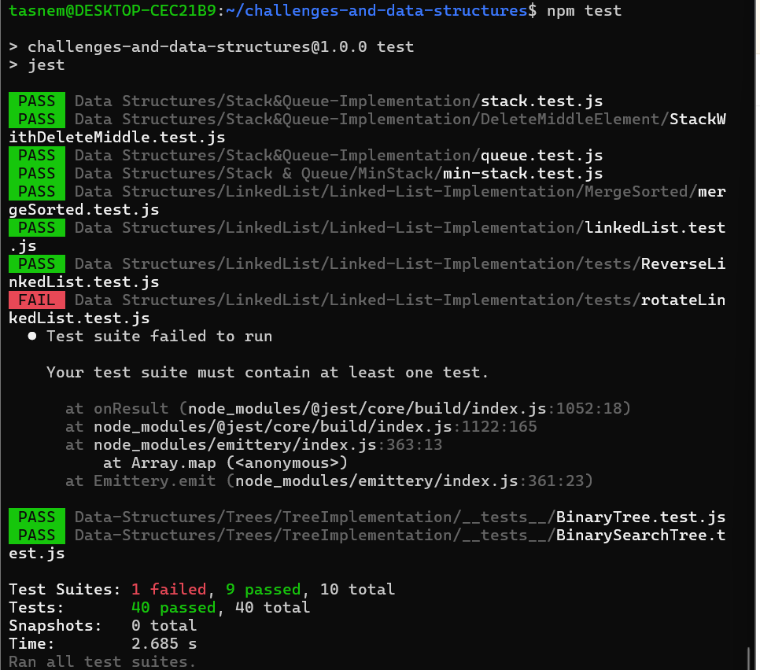
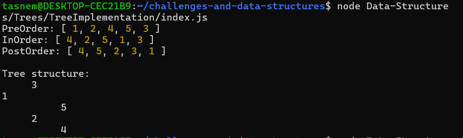
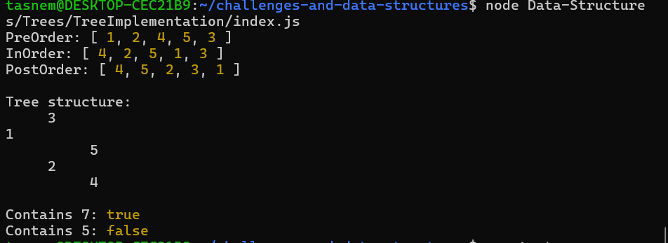
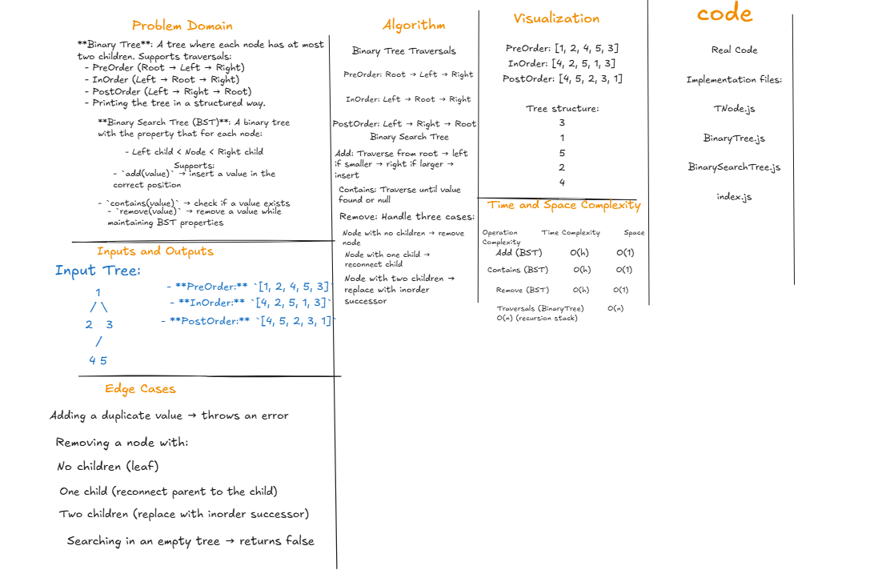

# Binary Tree & Binary Search Tree Implementation

## Problem Domain
Implement two data structures:
- **Binary Tree**: Supports traversals (PreOrder, InOrder, PostOrder) and printing the tree in a structured way.
- **Binary Search Tree (BST)**: Supports `add(value)`, `contains(value)`, and `remove(value)` while maintaining BST properties.

---
## npm tests

## consol output

## Whiteboard

