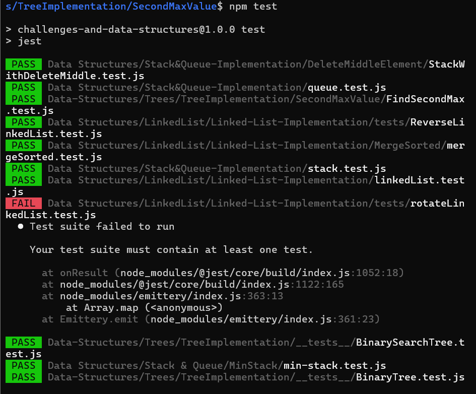
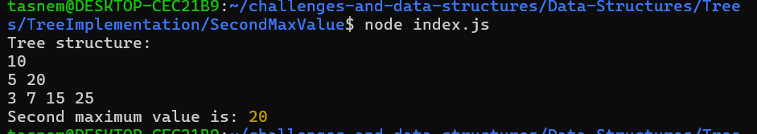
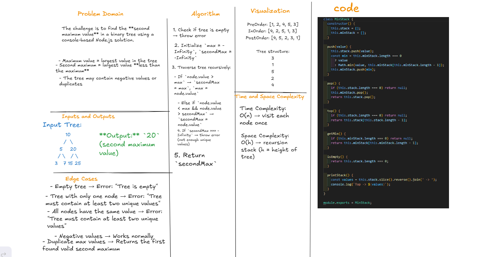

# Binary Tree - Second Maximum Value

## Problem Domain
The challenge is to find the **second maximum value** in a binary tree using a console-based Node.js solution.

- Maximum value = largest value in the tree
- Second maximum = largest value **less than the maximum**
- The tree may contain negative values or duplicates

## npm tests

## consol output

## Whiteboard
