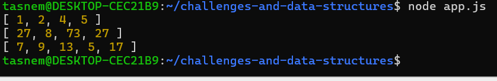

# Challenge 04: Remove Middle Value

## Challenge Description

Develop a function called `RemoveMiddleValue` that removes the middle value of an array without the use of built-in methods. Return the modified array.

## Input / Output Examples

- Input: [1, 2, 3, 4, 5]
Output: [1, 2, 4, 5]

- Input: [27, 8, 15, 73, 27]
Output: [27, 8, 73, 27]

- Input: [7, 9, 13, 25, 5, 17]
Output: [7, 9, 13, 5, 17]

## Whiteboard Image

